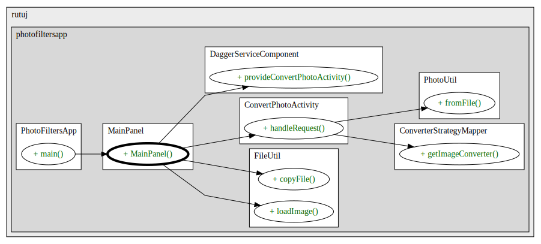

# Photo Filters App

This is a sample Java application that allows users to apply different filters to their photos. 
The application allows users to load an image from their local file system, apply filters to the image, and save the filtered image back to their local file system.
Currently, the application supports the following filters:
- Grayscale
- Sepia
- Invert


#### Key Features
- **User-Friendly Interface:** Built with Java Swing for a familiar and intuitive experience.
- **Image Manipulation:** Leverages Java AWT for efficient image processing.
- **Clean Architecture:**  Employs the Model-View-Controller (MVC) pattern for well-organized code.
- **Dependency Injection:** Uses Dagger for streamlined dependency management.
- **Build Automation:**  Powered by Gradle for easy project setup and management.

## Getting Started

These instructions will get you a copy of the project up and running on your local machine for development and testing purposes.

### Prerequisites

- Java 8 or higher
- Gradle

### Installation

1. Clone the repository
```bash
git clone https://github.com/RutujChheda/photofiltersapp.git
```

2. Navigate to the project directory
```bash
cd photofiltersapp
```

3. Build the project
```bash
   gradle build
```
4. Usage
```bash
   gradle run
```

## Architecture Diagrams


### PhotoFiltersApp Structure

[Project Structure](src/main/resources/MainPanel_structure.puml)

### PhotoFiltersApp Main Calls

[Project Calls Sequence](src/main/resources/MainPanel_0_MainPanel_calls.puml)


### Contributing
Pull requests are welcome. For major changes, please open an issue first to discuss what you would like to change.

Please make sure to update tests as appropriate. 

### How to Contribute:
1. Fork the repository.
2. Create a new branch for your feature or bug fix.
3. Make your changes and commit them with clear descriptions.
4. Push your changes to your fork.