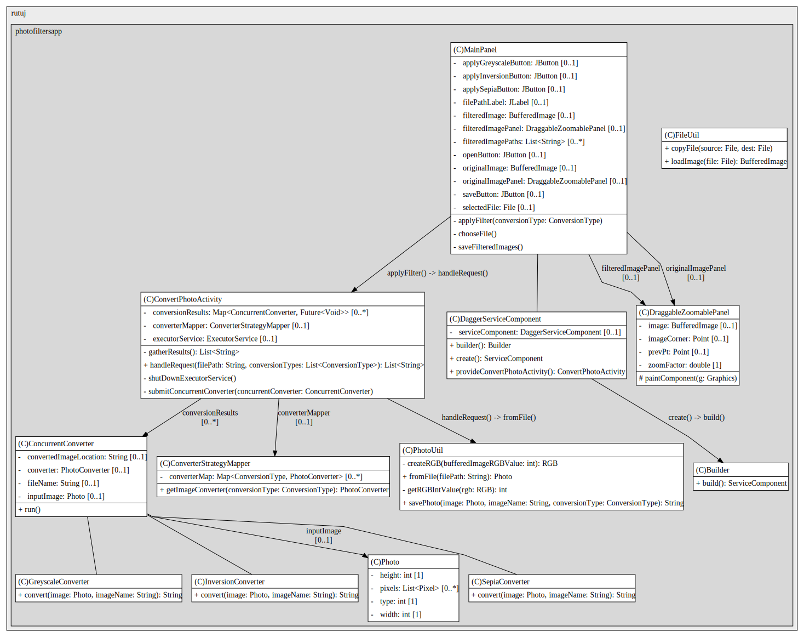

# Photo Filters App

This is a Java application that allows users to apply different filters to their photos. The application uses Dagger for dependency injection and Gradle for build automation.

## Getting Started

These instructions will get you a copy of the project up and running on your local machine for development and testing purposes.

### Prerequisites

- Java 8 or higher
- Gradle

### Installation

1. Clone the repository
```bash
git clone https://github.com/RutujChheda/photofiltersapp.git
```

2. Build the project
```bash
cd photofiltersapp
```

3. Usage
   To use the application, you need to run the PhotoConverterManualTester class. This class contains a main method that applies a set of filters to a photo.

## Architecture Diagrams

### PhotoConverterManualTester Main Calls


[Project Calls Sequence](src/main/resources/PhotoConverterManualTester_0_main_calls.puml)
### PhotoConverterManualTester Structure


[Project Structure](src/main/resources/PhotoConverterManualTester_structure.puml)